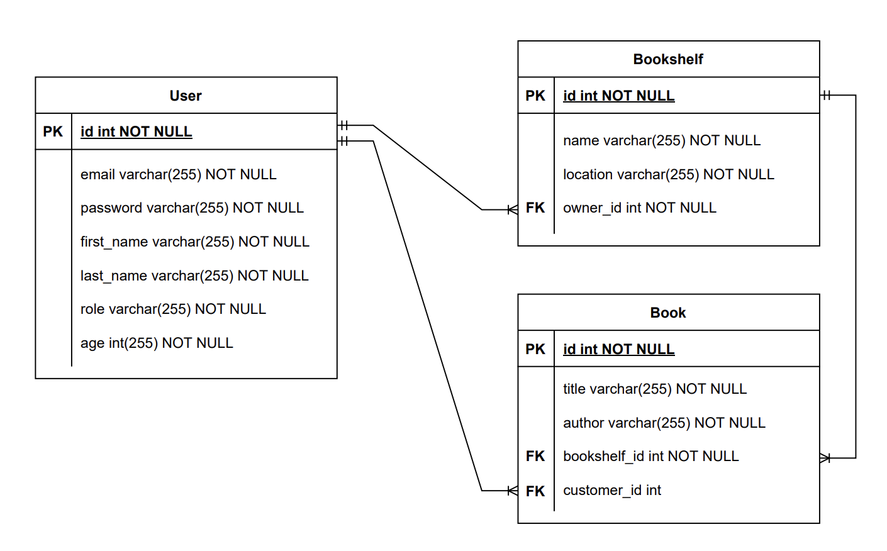

# My Library - SQL Injection
SQL Injection simulation lab for Cyber Security class

## Running the application locally
First, install the dependencies:
```bash
npm install
```
Then, run the application:
```bash
npm start
```
## ERD

